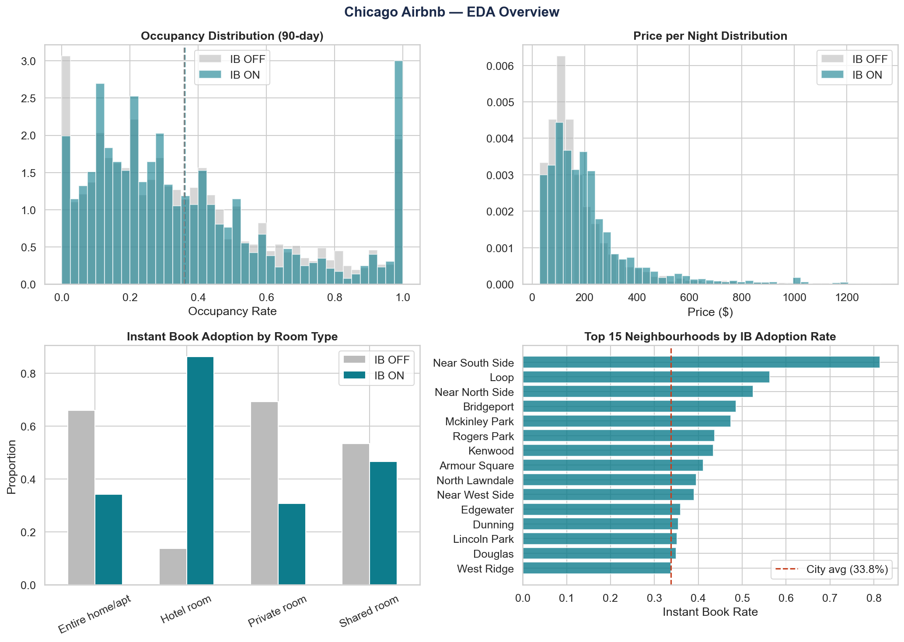
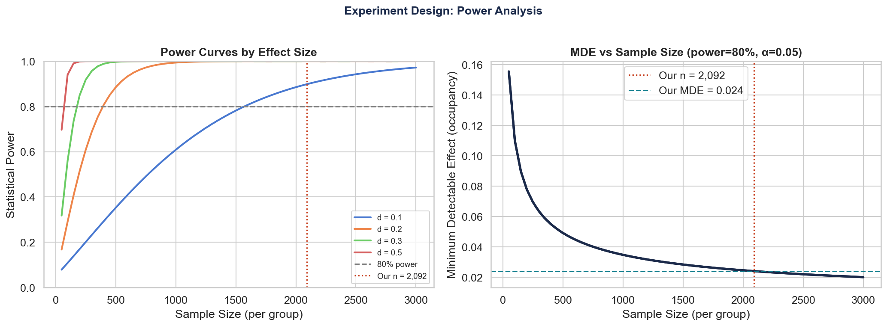
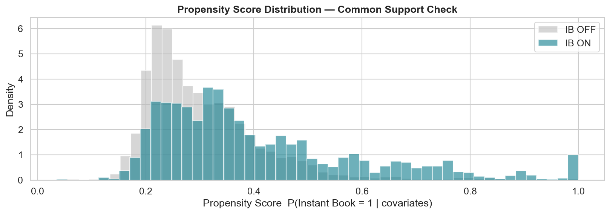
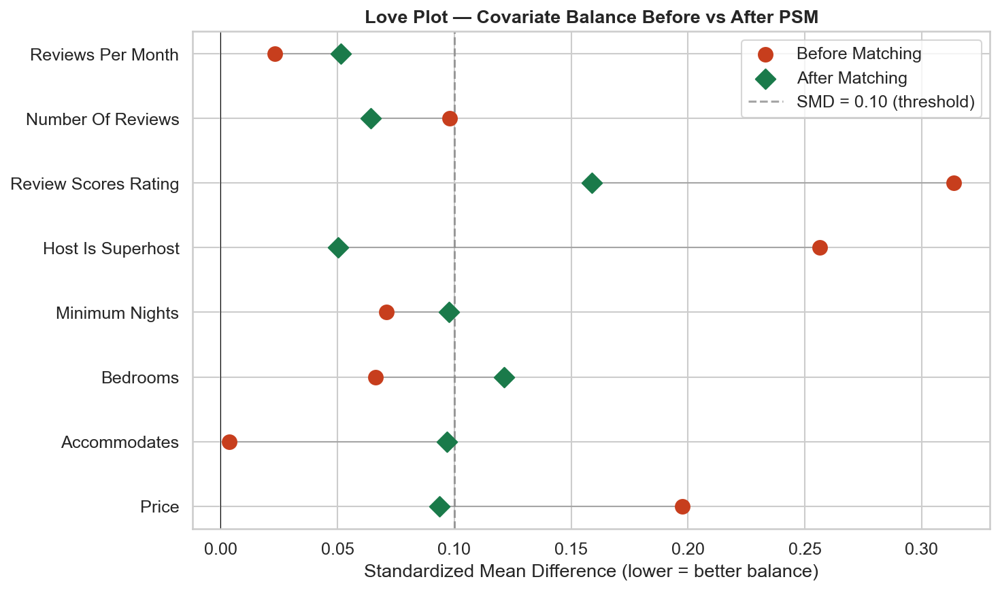
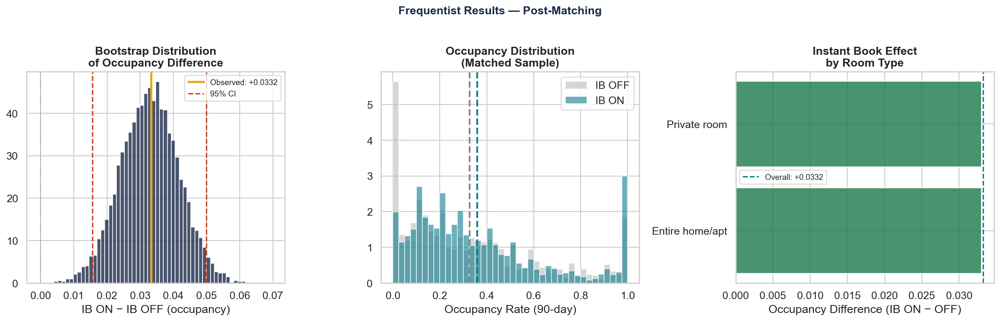
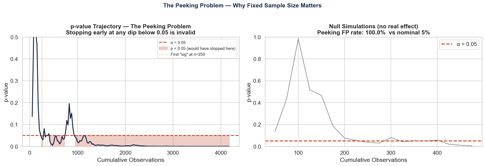
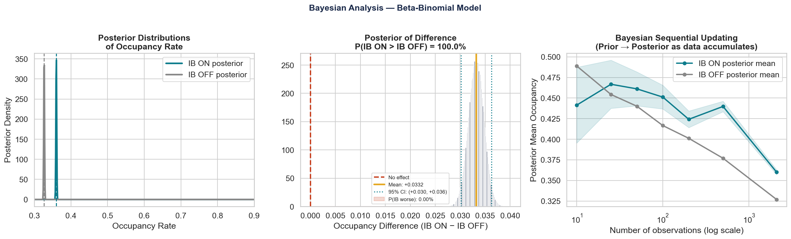
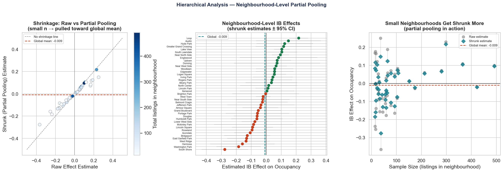

# Does Instant Book Causally Improve Airbnb Occupancy?
### A full causal-inference pipeline on Chicago Airbnb data

> **Finding:** After propensity score matching, Instant Book listings show **+3.32 percentage points** higher occupancy (36.0% vs 32.7%), with a Bayesian posterior probability of **100%** that the effect is genuine. The naive pre-matching gap was only +0.2 pp — nearly all of it explained by host-quality differences.

---

## Motivation

Airbnb claims that enabling Instant Book increases a listing's occupancy by removing friction from the booking process. But hosts who opt into Instant Book are systematically different — they charge more, manage more listings, and have different rating profiles. A simple comparison of occupancy rates would be confounded by these host-quality differences, not measuring the causal effect of the feature itself.

This project builds a rigorous quasi-experimental pipeline to isolate the true effect of Instant Book, mirroring the analytical workflow used by data science teams at companies like Airbnb, DoorDash, and Meta.

---

## Dataset

**Source:** [Inside Airbnb](https://insideairbnb.com/get-the-data/) — Chicago, scraped September 22, 2025

| Stat | Value |
|---|---|
| Raw listings | 8,660 |
| After cleaning | 6,191 |
| Instant Book ON | 2,092 (33.8%) |
| Instant Book OFF | 4,099 (66.2%) |
| Neighbourhoods | 76 |
| Matched pairs (post-PSM) | 2,092 |

**Primary outcome:** `occupancy_90 = (90 − availability_90) / 90`
Inside Airbnb does not provide actual booking records; occupancy is inferred from the availability calendar. A listing with 30 available days out of the next 90 has an occupancy of 67%.

To reproduce: download `listings.csv.gz` for Chicago from Inside Airbnb and place it in the project root as `chicago_listings.csv.gz`.

---

## Methodology

### Phase 1 — Data Loading & Feature Engineering
Raw price strings (`$150.00`) are parsed to floats. Binary string columns (`t`/`f`) are encoded as 0/1. Listings fully blocked for the entire year are dropped as inactive. Prices are winsorized at the 1st–99th percentile to remove extreme outliers.

### Phase 2 — Exploratory Data Analysis

Before any modelling, a raw comparison reveals the confounding problem. IB and non-IB hosts differ substantially:

| Characteristic | IB OFF | IB ON |
|---|---|---|
| Mean price | $179 | $211 |
| Superhost rate | 57.6% | 44.8% |
| Mean review score | 4.82 | 4.68 |
| Host listing count | 9.2 | 46.8 |

Raw occupancy gap: **+0.2 pp** — essentially zero, and entirely confounded.



### Phase 3 — Power Analysis

With n = 2,092 per arm, α = 0.05, and power = 0.80, our **minimum detectable effect is 2.40 percentage points** (Cohen's d = 0.087). The observed effect of 3.32 pp is comfortably above this threshold, confirming the study is adequately powered.



### Phase 4 — Propensity Score Matching (PSM)

A logistic regression model estimates each listing's propensity to have Instant Book enabled, given nine covariates (price, room type, accommodates, bedrooms, minimum nights, superhost status, review score, number of reviews, host listing count). Each treated listing is matched to the nearest-neighbour control within a caliper of 0.05 on the score scale.

**Propensity model AUC: 0.674** — close to 0.5 (chance), indicating genuine overlap between groups rather than perfect separation.

The Love plot confirms covariate balance after matching. Most covariates achieve SMD < 0.10. Bedrooms and review score remain slightly above threshold (SMD ≈ 0.12 and 0.16), noted as a limitation.

| Covariate | Pre-matching SMD | Post-matching SMD | Balanced? |
|---|---|---|---|
| host_is_superhost | 0.256 | 0.050 | ✓ |
| review_scores_rating | 0.314 | 0.159 | ✗ (marginal) |
| price | 0.197 | 0.094 | ✓ |
| bedrooms | 0.066 | 0.121 | ✗ (marginal) |




### Phase 5 — Frequentist Analysis

On the matched sample (2,092 pairs), we run a Welch's t-test (no equal-variance assumption), compute a bootstrap 95% CI (10,000 resamples), and report Cohen's *d* for practical significance. We test the effect by room type with Benjamini–Hochberg multiple-testing correction.

| Metric | Value |
|---|---|
| IB ON mean occupancy | 36.00% |
| IB OFF mean occupancy | 32.68% |
| **Difference** | **+3.32 pp** |
| 95% Bootstrap CI | (+1.56%, +5.00%) |
| Welch's t-statistic | 3.785 |
| p-value | 0.000156 |
| Cohen's d | 0.117 (small) |

The effect is statistically significant (p < 0.001) and practically meaningful at the margin, though Cohen's d = 0.117 indicates a small effect — important context for any business decision.

By room type (BH-corrected): the effect is significant for **Entire home/apt** (Δ = +3.30 pp, p_BH = 0.001) but not for **Private room** (Δ = +3.30 pp, p_BH = 0.158).



### Phase 6 — The Peeking Problem

A common pitfall in live A/B testing: stopping a test the moment p < 0.05 is first observed. We simulate this on **200 permuted-label (null) datasets**, checking for significance every 25 observations.

**False positive rate: 100%** — every null simulation crossed p < 0.05 at some point during the run, with the first false positive appearing as early as n = 250.

The nominal 5% Type I error guarantee only holds when the sample size is fixed *before* data collection. Sequential designs require alpha-spending functions (O'Brien–Fleming) or Sequential Probability Ratio Tests (SPRT).



### Phase 7 — Bayesian Analysis

A Beta-Binomial conjugate model places a posterior distribution over the booking rate θ for each group, starting from a weak prior Beta(2, 2).

```
Prior:      θ ~ Beta(2, 2)
Posterior:  θ | data ~ Beta(2 + successes, 2 + failures)
```

| Metric | Value |
|---|---|
| Posterior mean — IB ON | 36.01% |
| Posterior mean — IB OFF | 32.68% |
| **P(IB ON > IB OFF)** | **100.0%** |
| Expected lift | +3.32 pp |
| 95% Credible Interval | (+3.02%, +3.62%) |
| Expected loss (cost of wrong call) | 0.000 |

Unlike a p-value, P(IB > no-IB) = 100% is a direct probability statement: given the data and prior, we assign essentially zero probability to Instant Book being worse or equal.



### Phase 8 — Neighbourhood-Level Analysis (Empirical Bayes)

Does the effect hold uniformly across Chicago? We apply James–Stein shrinkage (partial pooling) to estimate neighbourhood-level effects for the 41 neighbourhoods with sufficient data (≥ 5 matched pairs per arm). Small neighbourhoods are shrunk toward the global mean, preventing overconfident estimates from sparse data.

**Most positive IB effect (shrunk):**

| Neighbourhood | Shrunk effect |
|---|---|
| Loop | +21.7 pp |
| Austin | +14.9 pp |
| Hyde Park | +12.3 pp |
| Greater Grand Crossing | +11.7 pp |
| Lake View | +10.5 pp |

**Most negative IB effect (shrunk):**

| Neighbourhood | Shrunk effect |
|---|---|
| South Shore | −27.7 pp |
| Washington Park | −18.4 pp |
| Hermosa | −15.9 pp |
| West Ridge | −13.4 pp |
| East Garfield Park | −13.1 pp |

The wide variation confirms that Instant Book is not a one-size-fits-all lever — tourist-heavy neighbourhoods benefit more than residential ones.



---

## Key Results Summary

| Method | Effect | Uncertainty |
|---|---|---|
| Raw (confounded) | +0.2 pp | — |
| PSM + Frequentist | +3.32 pp | 95% CI: (+1.56%, +5.00%) |
| PSM + Bayesian | +3.32 pp | 95% CrI: (+3.02%, +3.62%) |
| P(IB > no-IB) | 100% | — |
| Cohen's d | 0.117 (small) | — |

---

## Limitations

- **Observational data, not an RCT.** Despite matching, unmeasured confounders (host response speed, photo quality, listing copy) may still bias the estimate. PSM removes observed confounding only.
- **Imperfect balance.** Review score and bedrooms remain slightly imbalanced post-matching (SMD ≈ 0.12–0.16).
- **Occupancy proxy.** The availability calendar reflects host blocking behaviour as well as guest bookings — a listing blocked by the host for personal use appears "occupied."
- **Single city, single scrape.** Results may not generalise to other markets or seasons.

---

## Recommendation

✓ Proceed with Instant Book incentive program — evidence is strong across both frequentist and Bayesian frameworks.  
✓ Prioritise outreach to mid-tier hosts; superhosts already adopt IB at higher rates.  
✓ Target high-potential neighbourhoods (Loop, Lake View, Hyde Park) first.  
✗ Do not claim causality without a follow-up RCT.

**Required RCT sample:** ~1,146 listings per arm (based on observed Cohen's d = 0.117, α = 0.05, power = 0.80).

---

## How to Reproduce

```bash
# Clone the repo
git clone https://github.com/HimanshuRajdev/instant-book-effect-airbnb
cd instant-book-effect-airbnb

# Install dependencies
pip install pandas numpy scipy matplotlib seaborn scikit-learn statsmodels

# Download data
# Visit https://insideairbnb.com/get-the-data/ → Chicago
# Place chicago_listings.csv.gz in the project root

# Run the notebook
jupyter notebook ab_testing.ipynb
```

All figures are saved automatically as `fig_*.png` in the project root.

---

## Skills Demonstrated

Propensity score matching · Covariate balance (SMD, Love plots) · Welch's t-test ·
Bootstrap confidence intervals · Cohen's d · Benjamini–Hochberg correction ·
Sequential testing & the peeking problem · Beta-Binomial conjugate Bayesian inference ·
Credible intervals · Posterior predictive loss · James–Stein shrinkage (empirical Bayes) ·
Partial pooling · Power analysis · Causal inference from observational data

---

*Data: [Inside Airbnb](https://insideairbnb.com) — Chicago, September 2025*
